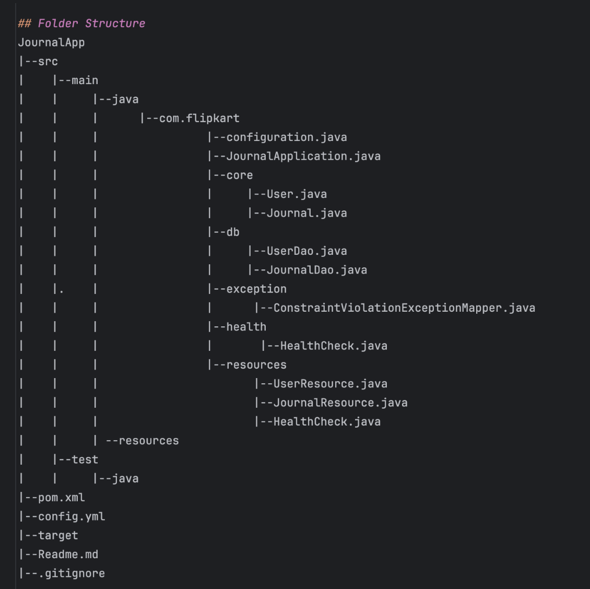
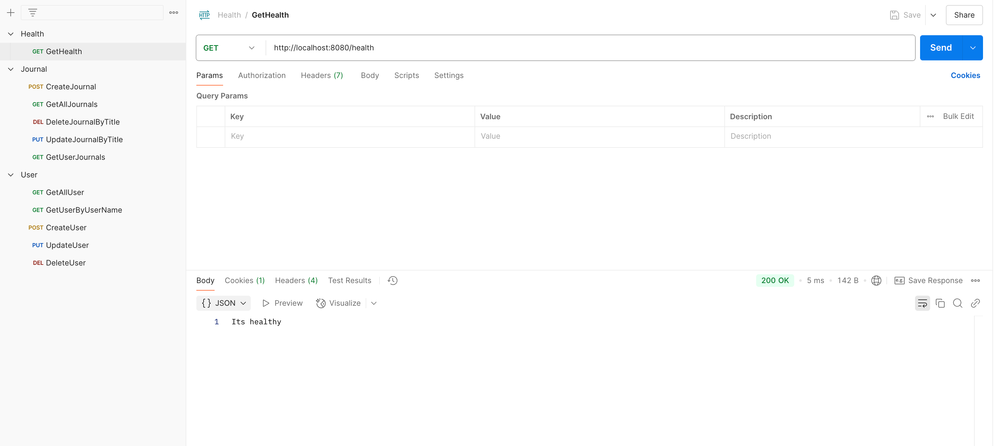

# JournalApp

## Overview
JournalApp is a RESTful API built using Dropwizard that allows users to create and manage journal entries.
The application follows a structured folder hierarchy and uses Hibernate for database interactions.

## Features
1. User management (Create, Read, Update, Delete)
2. Journal entry management (Create, Read, Update, Delete)
3. Relationship: One user can have multiple journal entries
4. Error handling with proper HTTP status codes
5. MySQL database integration

## Folder Structure

# API Endpoints
## User API

1. Create User (POST)
   Endpoint: /users
   ### Request Body:
   {
   "username": "username",
   "password": "password",
   "email": "email"
   }
   ### Responses:
       201 Created - User created successfully
       409 Conflict - Username already exists
       500 Internal Server Error - Database error

2. Get All Users (GET)
   Endpoint: /users
   ### Responses:
        200 OK - Returns list of users

3. Get User by Username (GET)
    Endpoint: /users/{username}
    ### Responses:
        200 OK - Returns user details
        404 Not Found - User not found

4. Update User by Username (PUT)
   Endpoint: /users/{username}
   ### Request Body:
   {
   "username": "username",
   "password": "password",
   "email": "email"
   }
   ### Responses:
       200 OK - User updated successfully
       404 Not Found - User not found
       409 Conflict - Username already exists
       500 Internal Server Error - Database error

5. Delete User by Username (DELETE)
   Endpoint: /users/{username}
   ### Responses:
       204 No Content - User deleted successfully
       404 Not Found - User not found

## Journal API

1. Create Journal by Username (POST)
    Endpoint: /journals/{username}
   ### Request Body:
   {
   "title": "My First Journal",
   "content": "This is my first journal entry."
   }
   ### Responses:
       201 Created - Journal entry created
       404 Not Found - User not found
       409 Conflict - Title already exists

2. Get All Journals (GET)
    Endpoint: /journals
    ###  Responses:
       200 OK - Returns list of journals

3. Get Journals by Username (GET)
   Endpoint: /journals/{username}/
   ### Responses:
       200 OK - Returns user's journal entries 
       404 Not Found - User not found

4. Get Journal by Title (GET)
   Endpoint: /journals/{title}
   ## Responses:
       200 OK - Returns journal entry
       404 Not Found - Journal not found

5. Update Journal by Title (PUT)
   Endpoint: /journals/{title}
    ### Request Body:
   {
   "title": "My First Journal",
   "content": "This is my first journal entry."
   }
    ### Responses:
       200 OK - Journal updated successfully
       404 Not Found - Journal not found
       409 Conflict - Title already exists

6. Delete Journal by Title (DELETE)
   Endpoint: /journals/{title}
   ### Responses:
       204 No Content - Journal deleted successfully
       404 Not Found - Journal not found
# Database Setup
  ## MySQL Configuration
  Ensure MySQL is running and configured in config.yml:
  {database:
  driverClass: com.mysql.cj.jdbc.Driver
  url: jdbc:mysql://localhost:3306/journalapp
  user: root
  password: password}
  ## Run the following SQL script to create tables:
  ### User Table 
       CREATE TABLE users (
       id INT AUTO_INCREMENT PRIMARY KEY,
       username VARCHAR(255) UNIQUE NOT NULL,
       password VARCHAR(255) NOT NULL ,
       email VARCHAR(255) NOT NULL
       ); 
### Journal Table 
    CREATE TABLE journals (
    id INT AUTO_INCREMENT PRIMARY KEY,
    title VARCHAR(255) UNIQUE NOT NULL,
    content VARCHAR(255),
    user_id INT,
    FOREIGN KEY (user_id) REFERENCES users(id)
    );

# Running the Application
### Build Application
    mvn clean install
### Run the jar file
    java -jar target/JournalApp-1.0-SNAPSHOT.jar server config.yml
### Testing the API
    Postman
    http://localhost:8080
To see your applications health enter url http://localhost:8081/healthcheck

## Postman Workspace 
